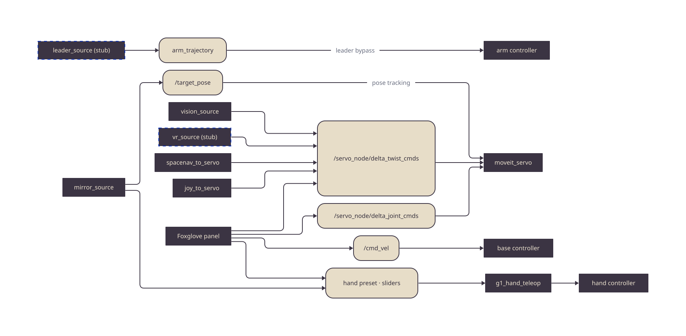

# Architecture

The teleop layer of First Motive's ROS2 stack. It converges many input
modalities — gamepad, SpaceMouse, leader arm, VR, vision, a Foxglove panel — onto
one command contract. Every source publishes standard ROS messages on fixed
channels; the sinks in the control stack consume them. Command channels carry
standard messages only — the contract is the architecture. Perception outputs are the
one exception: the tracked hand streams in `fm_teleop_msgs` are observations, not
commands, consumed by the mirror path here and by the data engine's ingest.

This repo is the teleop layer in isolation. The servo node and its safety config
(scaling, joint limits, collision checking) live in `fm_bringup`
([`fm-app`](https://github.com/first-motive/fm-app)); for the system-wide view see
[`fm-ros2`](https://github.com/first-motive/fm-ros2).

## Packages

| Package | Build | Responsibility |
|---------|-------|----------------|
| `fm_teleop_core` | ament_python | The contract (channel definitions), `TeleopSource` base node, pure retarget math |
| `fm_teleop_msgs` | ament_cmake | Perception interfaces (`HandSkeleton`, `HandQuality`) — observations, not commands |
| `fm_teleop_device` | ament_python | Physical device sources: gamepad, SpaceMouse, G1 hand presets/sliders |
| `fm_teleop_vision` | ament_python | Camera wrist-tracking source (MediaPipe Pose → arm twist, One-Euro filtered) |
| `fm_teleop_leader` | ament_python | Leader-arm source: leader joints → follower controller (bypasses Servo) |
| `fm_teleop_vr` | ament_python | VR-controller source — skeleton (`NotImplementedError`) |
| `fm_teleop_panel` | npm (TS/React) | Foxglove Studio operator panel — the primary fleet input |
| `fm_teleop` | ament_cmake (meta) | Metapackage bundling the ROS input packages |

## The Contract

Every source normalizes onto fixed channels defined once in
`fm_teleop_core/contract.py`. Sources publish through
`TeleopSource.contract_publisher(channel)` — never a hard-coded topic — and the
sinks subscribe the fixed topics. Swap an input device without touching anything
downstream.



Source: [`diagrams/contract.d2`](diagrams/contract.d2).

| Channel | Message | Default topic | Role |
|---------|---------|---------------|------|
| `arm_twist` | `geometry_msgs/TwistStamped` | `/servo_node/delta_twist_cmds` | Cartesian arm jog → MoveIt Servo |
| `arm_joint` | `control_msgs/JointJog` | `/servo_node/delta_joint_cmds` | Per-joint arm jog → MoveIt Servo |
| `arm_pose_target` | `geometry_msgs/PoseStamped` | `/target_pose` | Absolute EE pose → MoveIt Servo PoseTracking |
| `base_twist` | `geometry_msgs/Twist` | `/cmd_vel` | Mobile base velocity → drive controller |
| `hand_preset` | `std_msgs/String` | per-side | Named pose (open/close/pinch) → hand teleop |
| `hand_sliders` | `std_msgs/Float64MultiArray` | per-side | Raw joint targets → hand teleop |
| `arm_trajectory` | `trajectory_msgs/JointTrajectory` | per-arm | Full trajectory → controller (leader bypass, skips servo) |

Sources emit unitless (−1…1) magnitudes; the servo in `fm_bringup` scales them and
enforces the safety limits. That split is deliberate: teleop owns *intent*,
control owns *limits*.

## Sources

| Source | Node | Input | Emits |
|--------|------|-------|-------|
| Gamepad | `joy_to_servo` | `sensor_msgs/Joy` on `/joy` | `arm_twist` |
| SpaceMouse | `spacenav_to_servo` | `geometry_msgs/Twist` on `/spacenav/twist` (Linux/USB only) | `arm_twist` |
| Vision | `vision_source` | camera → MediaPipe wrist track, enabled by `/vision_teleop/enable` deadman | `arm_twist` |
| Vision mirror | `mirror_source` | `fm_teleop_msgs/HandSkeleton` from `hand_tracker` | `arm_pose_target`, `hand_preset` |
| Hand | `g1_hand_teleop` | preset/slider topics | `JointTrajectory` to hand controllers |
| Panel | Foxglove extension | browser widgets | `arm_twist`, `arm_joint`, `base_twist`, hand channels |
| Leader | `leader_source` | leader `/joint_states`, enabled by `~/enable` deadman | `arm_trajectory` |
| VR | `vr_source` *(stub)* | VR pose/buttons | `arm_twist`, `base_twist`, hand (planned) |

The Foxglove panel is the richest source: it is robot-aware (mirrors the
`fm_bringup` registry), merges every active widget per topic before publishing, and
drives single-arm robots, the bimanual G1-D (two servo nodes, wheeled base, two
hands), and SO101.

### Vision Pipeline

`vision_source` is the one source with real signal processing:

```
camera → latest-frame capture → MediaPipe Pose (wrist, metres)
       → Vec3 One-Euro filter → displacement_to_twist → arm_twist → servo
```

A rising edge on the enable deadman captures the current wrist as the neutral
origin; holding it jogs proportional to displacement; releasing publishes a zero
twist and forgets the origin. MediaPipe axes are remapped to REP-103 (forward ←
+z, left ← −x, up ← −y). The MediaPipe wrapper and the One-Euro filter are pure
modules — importable and testable without the camera stack.

## Design Notes

| Principle | How it shows up | Payoff |
|-----------|-----------------|--------|
| **One contract, many sources** | Every source publishes through `fm_teleop_core/contract.py` | A new input device is a new node, nothing downstream changes |
| **Intent vs limits split** | Sources emit unitless magnitudes; servo scales + clamps | Safety lives in one place, not per device |
| **Pure math, no ROS** | `retarget.py`, `filters.py`, `pose.py`, `hand_presets.py` | Retarget and filtering unit-test without rclpy or hardware |
| **Standard messages on commands** | Every contract channel is a standard interface; `fm_teleop_msgs` carries perception output only | Any ROS tool can inspect the channels; no command interface to version |

Per-package detail lives in each `<package>/README.md`.
